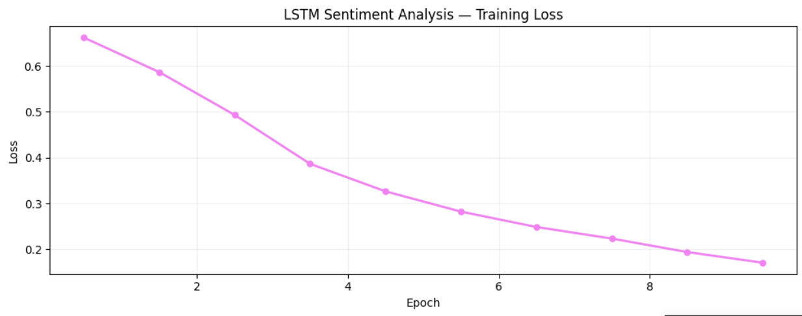

# IMDB Sentiment Analysis with Bidirectional LSTM

A Bidirectional LSTM built from scratch in PyTorch to classify
movie reviews as positive or negative, achieving 86.08% accuracy
on 25,000 IMDB test reviews.

---

## Results

| Metric | Value |
|--------|-------|
| Test Accuracy | 86.08% |
| Training Epochs | 10 |
| Dataset | IMDB (50,000 reviews) |
| Vocabulary Size | 25,000 words |
| Embedding Dimension | 128 |
| Hidden Dimension | 256 |

---

## Loss Curve



---

## Model Architecture
```
Input Text
    ↓
Tokenizer → removes HTML, lowercases, splits into words
    ↓
Vocabulary Encoding → each word converted to a number
    ↓
Embedding Layer → each number converted to 128-dim vector
    ↓
Bidirectional LSTM (2 layers, 256 hidden units)
    → reads review forward AND backward simultaneously
    ↓
Final Hidden State → 512 numbers summarizing whole review
    ↓
Dropout (0.3) → prevents overfitting
    ↓
Linear Layer → single score
    ↓
Sigmoid → probability 0 to 1
    ↓
> 0.5 = Positive   < 0.5 = Negative
```

---

## LSTM vs BERT Comparison

| Model | Accuracy | Epochs | Approach |
|-------|----------|--------|----------|
| Bidirectional LSTM (this project) | 86.08% | 10 | Built from scratch |
| Fine-tuned BERT | 92.24% | 3 | Transfer learning |

The most revealing test was a mixed review:
*"The acting was poor but the story was surprisingly good"*

| Model | Prediction | Confidence |
|-------|-----------|------------|
| LSTM | Negative | 53.3% |
| BERT | Positive | 97.5% |

LSTM was confused by mixed signals. BERT correctly identified
the overall sentiment because self-attention understands which
part of the sentence carries more weight.

---

## Sample Predictions

| Review | Sentiment | Confidence |
|--------|-----------|------------|
| "absolutely brilliant, loved every second" | Positive 😊 | 99.8% |
| "worst film I have ever seen" | Negative 😞 | 99.9% |
| "okay, nothing special but not terrible" | Negative 😞 | 92.8% |
| "poor acting but story was surprisingly good" | Negative 😞 | 53.3% |
| "fell asleep halfway, extremely boring" | Negative 😞 | 99.3% |

---

## Key Techniques

- Custom tokenizer — removes HTML tags, handles punctuation
- Vocabulary of 25,000 most common words
- Sequence padding to handle variable length reviews
- Bidirectional LSTM — reads context from both directions
- Gradient clipping (max norm=1.0) — prevents exploding gradients
- Dropout (0.3) — prevents overfitting

---

## Why Bidirectional LSTM?

A normal LSTM reads left to right only:
```
"I love this movie"  →  read forward only
```

A Bidirectional LSTM reads both ways simultaneously:
```
Forward:   "I" → "love" → "this" → "movie"
Backward:  "movie" → "this" → "love" → "I"
```

This gives the model full context from both directions,
which significantly improves understanding of sentiment.

---

## Setup and Usage

Clone the repository:

    git clone https://github.com/rohith-baskaran-ai/imdb-lstm-sentiment.git
    cd imdb-lstm-sentiment

Install dependencies:

    pip install -r requirements.txt

Run training:

    python lstm_sentiment.py

---

## Tech Stack

- Python 3.11
- PyTorch 2.1
- HuggingFace Datasets
- NumPy
- Matplotlib